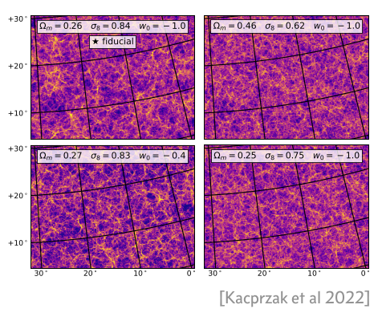
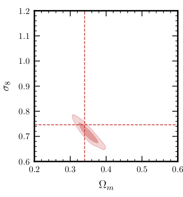
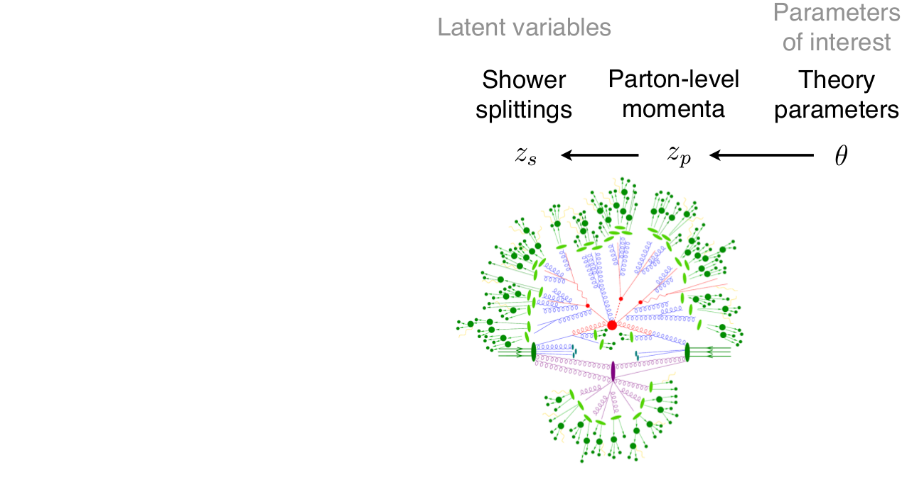
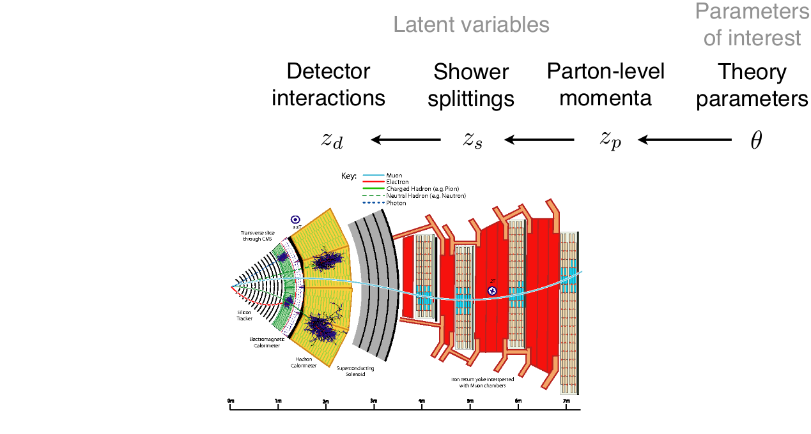
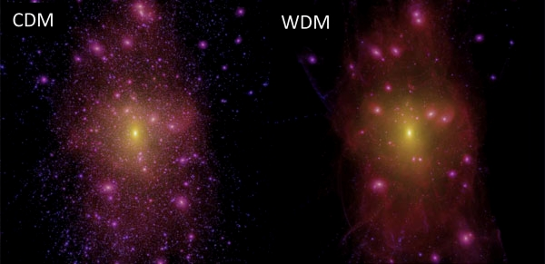
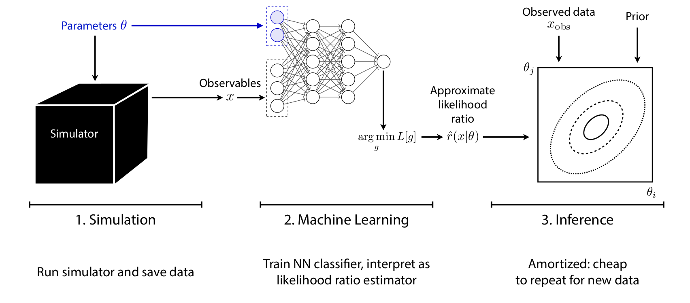
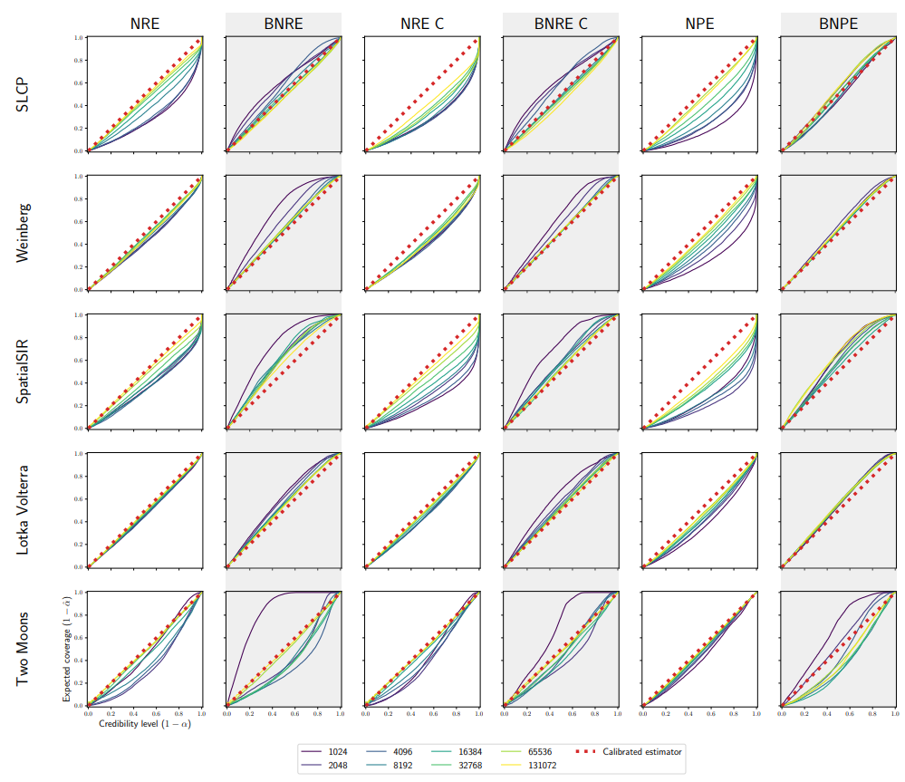

class: middle, center, title-slide

# Simulation-based inference for the physical sciences

<br>

Grenoble Artificial Intelligence for Physical Sciences<br>
May 29, 2024

<br>

Gilles Louppe<br>
[g.louppe@uliege.be](mailto:g.louppe@uliege.be)

---

class: middle, center

.center.width-80[]

---

class: middle

$$
v_x = v \cos(\alpha),~~ v_y = v \sin(\alpha),
$$

$$
\frac{dx}{dt} = v_x,~~\frac{dy}{dt} = v_y, \frac{dv_y}{dt} = -G.
$$

---

class: middle

```python
def simulate(v, alpha, dt=0.001):
    v_x = v * np.cos(alpha)  # x velocity m/s
    v_y = v * np.sin(alpha)  # y velocity m/s
    y = 1.1 + 0.3 * random.normal()
    x = 0.0

    while y > 0: # simulate until ball hits floor
        v_y += dt * -G  # acceleration due to gravity
        x += dt * v_x
        y += dt * v_y

    return x + 0.25 * random.normal()
```

---

class: middle, center

.center.width-100[]

---

class: middle, center

What parameter values $\theta$ are the most plausible?

---

class: middle

.center.width-100[]

---

class: middle

# Simulation-based inference

---

class: middle

## Simulators as generative models

A simulator prescribes a generative model that can be used to simulate data $\mathbf{x}$. 

.center.width-100[]

.footnote[Credits: [Siddharth Mishra-Sharma](https://smsharma.io/iaifi-summer-school-2023/), 2023.]

---

class: middle

## Conditional simulators

A conditional simulator prescribes a way to sample from the likelihood $p(\mathbf{x}|\theta)$, where $\theta$ is a set of conditioning variables or parameters.

.center.width-100[]

.footnote[Credits: [Siddharth Mishra-Sharma](https://smsharma.io/iaifi-summer-school-2023/), 2023.]

---

class: middle

## What can we do with generative models?

.grid[
.kol-1-3.center[

Produce samples and make predictions $$\mathbf{x} \sim p(\mathbf{x} | \theta)$$

]
.kol-1-3.center[
Evaluate densities  $$p(\mathbf{x}|\theta)$$ $$p(\theta | \mathbf{x}) = \frac{p(\mathbf{x} | \theta) p(\theta)}{p(\mathbf{x})}$$

]
.kol-1-3.center[
Encode complex priors $$p(\mathbf{x})$$

]
]

.grid[
.kol-1-3.center[.width-100[]]
.kol-1-3.center[.width-100[]]
.kol-1-3.center[.width-90[]]
]

.footnote[Credits: [Siddharth Mishra-Sharma](https://smsharma.io/iaifi-summer-school-2023/), 2023.]

---

class: middle

## Inference

.center.width-100[]

- Frequentist inference: find the parameters $\hat{\theta}$ that maximizes the likelihood $p(\mathbf{x}|\theta)$ or build a confidence interval thereof.
- Bayesian inference: compute the posterior distribution $$p(\theta | \mathbf{x}) = \frac{p(\mathbf{x} | \theta) p(\theta)}{p(\mathbf{x})}$$
of the parameters $\theta$ given the data $\mathbf{x}$.

???

... but most importantly, we want to test those models against data. 

---

class: middle

.center.width-100[]

Examples of inference problems across the physical sciences
- Discovering new particles in high-energy physics
- Data assimilation in weather forecasting
- Estimating gravitational wave parameters
- Retrieving atmospheric properties of exoplanets
- Constraining cosmological models from galaxy surveys

---

class: middle

## Intractable likelihoods

The (modeled) data generating process may involve additional latent variables $\mathbf{z}$ that are not observed, leading to likelihoods $$p(\mathbf{x}|\theta) = \int p(\mathbf{x}, \mathbf{z}|\theta) d\mathbf{z}.$$
In this case, evaluating the likelihood becomes intractable.

.grid[
.kol-1-2.center[.width-100[]
]
.kol-1-2.center[

<video width="50%" autoplay loop muted playsinline>
  <source src="figures/sbi/galton.mp4" type="video/mp4">
</video>

]
]

---

class: middle, black-slide
background-image: url(./figures/sbi/lhc.gif)


---

class: middle

$$p(\mathbf{z}\_p|\theta)$$

.width-100[]

???

generation: pencil and paper calculable from first principles

---

count: false
class: middle

$$p(\mathbf{z}\_s|\theta) = \int p(\mathbf{z}\_p|\theta) p(\mathbf{z}\_s | \mathbf{z}\_p) d\mathbf{z}\_p$$

.width-100[]

???

parton shower + hadronization: controlled approximation of first principles + phenomenological model

---

count: false
class: middle

$$p(\mathbf{z}\_d|\theta) = \iint p(\mathbf{z}\_p|\theta) p(\mathbf{z}\_s | \mathbf{z}\_p) p(\mathbf{z}\_d | \mathbf{z}\_s) d\mathbf{z}\_p d\mathbf{z}\_s$$

.width-100[]

???

detector simulation: interaction with the materials and digitization

---

count: false
class: middle

$$p(\mathbf{x}|\theta) = \underbrace{\iiint}\_{\text{yikes!}} p(\mathbf{z}\_p|\theta) p(\mathbf{z}\_s | \mathbf{z}\_p) p(\mathbf{z}\_d | \mathbf{z}\_s) p(\mathbf{x}|\mathbf{z}\_d) d\mathbf{z}\_p d\mathbf{z}\_s d\mathbf{z}\_d$$

.width-100[]

???

reconstruction simulation

Note that in some fields, stochastic simulations are rarely used. Instead the forward model is a deterministic function of the parameters + some noise. Yet, even in this case, simulation-based inference can be used to infer the parameters.

---

class: middle

.center.width-100[]

.alert[Statistical inference becomes challenging when the likelihood $p(\mathbf{x}|\theta)$ is implicit or intractable. .bold[Simulation-based inference algorithms are needed.]]

---

class: middle

.avatars[]

# A case study

Hermans et al, "Constraining dark matter with stellar streams", 2021.

---

class: black-slide, middle, center

.width-100[]

Can we constrain the nature of dark matter from cosmological observations?

---

background-image: url(./figures/sbi/stellar.jpeg)
background-position: left
class: black-slide

.smaller-x[ ]
## Constraining dark matter with stellar streams
<br><br><br><br><br><br>
.pull-right[
  
<iframe width="400" height="300" src="https://www.youtube.com/embed/uQVv_Sfxx5E?&loop=1&start=1&autoplay=1" frameborder="0" volume="0" allowfullscreen></iframe>

]

.footnote[Image credits: C. Bickel/Science; [D. Erkal](https://t.co/U6KPgLBdpz?amp=1).].]

---

class: middle

$$p(m\_\text{WDM}, t\_\text{age} | \text{GD1}) = \frac{p(\text{GD1} | m\_\text{WDM}, t\_\text{age}) p(m\_\text{WDM}, t\_\text{age})}{p(\text{GD-1})}$$

---

class: middle

.avatars[]

## Neural ratio estimation (NRE)

The likelihood-to-evidence $r(\mathbf{x}|\theta) = \frac{p(\mathbf{x}|\theta)}{p(\mathbf{x})} = \frac{p(\theta,\mathbf{x})}{p(\theta)p(\mathbf{x})}$ ratio can estimated from a binary classifier $d(\theta,\mathbf{x})$, even if neither the likelihood nor the evidence can be evaluated.
.grid[
.kol-1-4.center[

<br>

$\theta,\mathbf{x} \sim p(\theta,\mathbf{x})$

<br><br><br><br>

$\theta,\mathbf{x} \sim p(\theta)p(\mathbf{x})$

]
.kol-5-8[<br>.center.width-70[]]
.kol-1-8[<br><br><br><br>

$\hat{r}(\mathbf{x}|\theta)$]
]

.footnote[Credits: [Cranmer et al](https://arxiv.org/pdf/1506.02169.pdf), 2015; [Hermans et al](http://proceedings.mlr.press/v119/hermans20a/hermans20a.pdf), 2020.]

---

class: middle

.avatars[]

The solution $d$ found after training  approximates the optimal classifier
$$d(\theta,\mathbf{x}) \approx d^\*(\theta,\mathbf{x}) = \frac{p(\theta,\mathbf{x})}{p(\theta,\mathbf{x})+p(\theta)p(\mathbf{x})}.$$
Therefore, $$r(\mathbf{x}|\theta) = \frac{p(\mathbf{x}|\theta)}{p(\mathbf{x})} = \frac{p(\theta,\mathbf{x})}{p(\theta)p(\mathbf{x})} \approx \frac{d(\theta,\mathbf{x})}{1-d(\theta,\mathbf{x})} = \hat{r}(\mathbf{x}|\theta).$$

???

Derive on blackboard.

---

class: middle

.avatars[]

.center.width-100[]

$$p(\theta|\mathbf{x}) \approx \hat{r}(\mathbf{x}|\theta) p(\theta) $$

---

class: middle

.avatars[]

## NRE for stellar streams

.center.width-90[]

.center[
.width-35[]
.width-35[]

]

.footnote[Credits: [Hermans et al](https://arxiv.org/pdf/2011.14923), 2021.]

---

class: black-slide, middle, center

.width-100[]

Preliminary results for GD-1 suggest a preference for CDM over WDM.

---

class: middle, black-slide

.grid[
.kol-2-3.center[<br><br><br>Wait a minute Gilles...<br> I can't claim that in a paper!<br> Your neural network must be wrong!]
.kol-1-3.center[

.circle.width-100[]

]
]

---

class: middle

.grid[
.kol-2-3[

<br>
## Expected coverage

$$\text{EC}(\hat{p}, \alpha) = \mathbb{E}\_{p(\theta, \mathbf{x})}[\theta \in \Theta\_{\hat{p}(\theta|\mathbf{x})}(\alpha)]$$

If the expected coverage is close to the nominal coverage probability $\alpha$, then the approximate posterior $\hat{p}$ is calibrated.

- If $\text{EC} < \alpha$, then the posterior is underdispersed and overconfident.
- If $\text{EC} > \alpha$, then the posterior is overdispersed and conservative.

]
.kol-1-3[
.center.width-100[]
.center.width-95[]
]
]

.footnote[Credits: [Hermans et al](https://arxiv.org/abs/2110.06581), 2021; [Siddharth Mishra-Sharma](https://arxiv.org/abs/2110.01620), 2021.]

---

class: middle

.avatars[]

## Balancing inference<br> for conservative posteriors

.center.width-60[]

Conservative posteriors can be obtained by enforcing $d$ to be balanced, i.e. such that $\mathbb{E}\_{p(\theta,\mathbf{x})}\left[d(\theta,\mathbf{x})\right] = \mathbb{E}\_{p(\theta)p(\mathbf{x})}\left[1 - d(\theta,\mathbf{x})\right]$.

.footnote[Credits: [Delaunoy et al](https://arxiv.org/abs/2208.13624), 2022; [Delaunoy et al](https://arxiv.org/abs/2304.10978), 2023.]

---

class: middle

# Summary

---

class: middle

.success[Simulation-based inference is a major evolution in the statistical capabilities for science, as it enables the analysis of complex models and data without simplifying assumptions.]

.alert[Obstacles remain to be overcome, such as the curse of dimensionality, the need for large amounts of data, or the necessary robustness of the inference network.]
